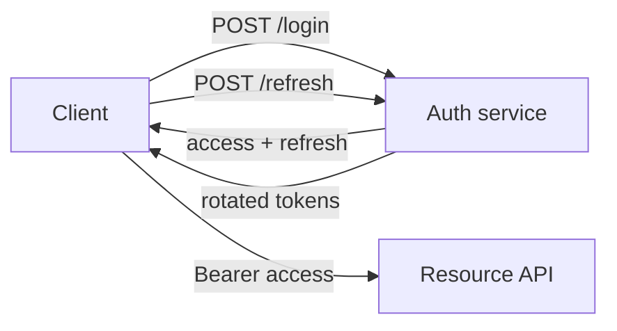

## Overview

We are adding **stateless session tokens** to the API. This section shows the
block vocabulary at a glance.

:::callout{tone=decision}
We commit to **signed JWT access tokens (15 min)** plus an opaque refresh token
stored server-side. This is the hard-to-reverse wire-format bet.
:::

:::callout{tone=warn}
Refresh tokens are bearer credentials — never log them, never put them in URLs.
:::

### Architecture

### Before / after

::::columns
:::col{label=Before}
- Server-side session row per request
- Sticky sessions required
- Hard to scale horizontally
:::
:::col{label=After}
- Stateless access tokens
- Any node validates the signature
- Refresh row is the only DB read
:::
::::

:::details{summary="Why not opaque access tokens too?"}
Opaque access tokens force a DB lookup on every request. Signed JWTs let edge
nodes validate locally; we accept a 15-minute revocation window in exchange.
:::
