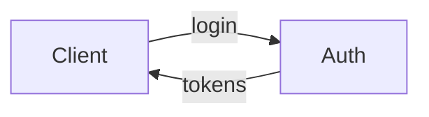

# Authoring blocks — single source of truth

Read this in full before authoring a visual-docs source file. The compiler
(`scripts/build.mjs`) understands CommonMark + GitHub-Flavored Markdown plus the
container directives below. Block names echo the agent-native vocabulary on
purpose. Do not invent directive names — unknown directives render as a plain
labelled container.

## Quality bar

Write a serious technical document, not marketing. Outcome-first, prose-first,
self-contained, specific. Name real files, symbols, and data shapes. Lead with
what is reused before what is new. Put one concrete example near the top when the
idea is abstract. Every block must carry substance — never a tab that hides only
a sentence, never a diagram that restates a list.

## Frontmatter

```yaml
---
title: Session Auth Spec          # required
subtitle: One-line context        # optional, shown in the header
mode: doc                         # doc | plan | recap  (drives the header badge)
updated: 2026-06-24               # optional ISO date
parts:                            # optional — multi-file spec assembly
  - 01-overview.md
  - 02-data.md
---
```

## Standard Markdown

Headings (`##` and `###` populate the sticky TOC and become collapsible
sections), GFM tables, task lists, links, blockquotes, inline `code`, and fenced
code blocks. Fenced code is syntax-highlighted at build time (highlight.js) with
one wrapped span per line. Use ` ```diff ` for diffs — `+`/`-` lines color
automatically.

## Directives

Container directives open with `:::name` and close with `:::`. Attributes go in
`{braces}`.

**Two parser rules you must follow (both matter):**

1. **Quote any attribute value containing a space:** `{title="POST /login"}`,
   not `{title=POST /login}`. An unquoted space breaks the directive — the whole
   `:::name{…}` line leaks as literal text (and a truncated label is the milder
   case: `{title=Open Questions}` silently becomes just "Open"). Single-word
   values need no quotes (`{tone=decision}`, `{label=Before}`).
2. **Nested containers: outer uses 4 colons, inner uses 3.** `::::columns`
   wrapping `:::col`, `::::tabs` wrapping `:::tab`. At equal depth the directives
   still parse, but the outer closing fence is orphaned and leaks a stray `:::`.
   Non-nested blocks (callout, file-tree, annotated-code, details, questions)
   use plain `:::`.

### callout — `:::callout{tone=...}`
Tones: `note` (default), `info`, `decision`, `warn`, `ok`. The tone renders a
label and color. Use `decision` for a settled choice, `warn` for hazards.

```
:::callout{tone=decision}
We commit to signed JWT access tokens. This is the hard-to-reverse bet.
:::
```

### columns / col — side-by-side comparison
Outer `columns` uses 4 colons, inner `col` uses 3 (see rule 2 above).
```
::::columns
:::col{label=Before}
- old behavior
:::
:::col{label=After}
- new behavior
:::
::::
```
Columns auto-wrap responsively. Use for before/after or current/target.

### tabs / tab — alternatives or states
Outer `tabs` uses 4 colons, inner `tab` uses 3; quote any spaced `title`.
```
::::tabs
:::tab{title="POST /login"}
…content…
:::
:::tab{title="POST /refresh"}
…content…
:::
::::
```
The runtime builds the tab bar from each `tab`'s `title`.

### file-tree — annotated file map
A nested Markdown list inside a `:::file-tree`. Use `*italic*` for the per-file
note. Highlight only the files worth reading.
```
:::file-tree
- src/
  - auth.ts — *issue + verify tokens (new)*
  - routes.ts — *wire /login*
:::
```

### annotated-code — real source with margin notes
Pulls an actual file (relative to the doc directory), highlights it, and lists
line-anchored notes. Each note is `RANGE: text` (e.g. `9-14: signs the JWT`).
Clicking a note in the rendered doc highlights and scrolls to those lines.
```
:::annotated-code{file=src/auth.ts lang=ts}
- 3-6: config constants — the 15-minute TTL lives here
- 9-14: issueTokens signs the access JWT
:::
```
Optional `lines=10-40` shows only an excerpt; line numbers in notes stay
absolute (file-relative). Prefer a few high-signal notes over one per line.

### details — collapsible aside
```
:::details{summary=Why not opaque access tokens?}
…the long answer…
:::
```

### questions — one bottom block for open decisions
Put unresolved decisions here, and nowhere else. Mark a recommended default.
```
:::questions{title=Open Questions}
1. Rotate refresh token on every refresh, or near expiry? (recommended: every refresh)
2. Device-scoped refresh tokens?
:::
```

### Mermaid diagrams
Use a fenced ` ```mermaid ` block. Rendered client-side from the inlined library
(only inlined when the doc actually uses it). Prefer two-dimensional layouts
(flowchart, sequence, state) over a single chain. Keep labels short.

````

````

## What the reader gets

Sticky multi-level TOC with scrollspy, collapsible `##` sections, a "Collapse
all" toggle, in-page section filter (the search box), per-block tab switching,
copy buttons on code, annotation line-jumps, and a light/dark toggle — all from
a single offline file.
